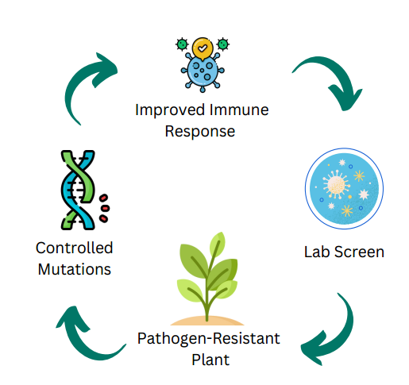
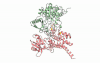

# Engineering Pathogen-Resistant Crops using Directed Evolution

We use directed evolution to disrupt interaction between pathogenic proteins and plants’ immune system.

## Challenge

Worldwide, 20-40% of crop yield is lost to pests, costing the global economy a combined $290 billion per year. Pesticides are currently the most commonly used protection mechanism, but they have a huge negative impact on the environment and pose health risks to humans.

## Our Approach

We will disrupt the pathogen-plant interaction between a pathogen recognition receptor (PRR) of the plant immune system and a bacterial effector protein that supresses the PRR. Interaction will be disrupted using directed evolution. We will generate a library of PRR mutants and select for reduced binding affinity using a modified yeast two-hybrid screen. Best mutants will be transiently expressed in plant cells for the final validation.

## Expected Result

Identified mutations can be introduced into plants using CRISPR-based precision gene editing. This way, it is possible to generate non-transgenic strains, which don’t contain any mutations or genes that couldn’t occur in the plant naturally. Under the new EU regulation such plants won’t be considered GMOs in the future.  

