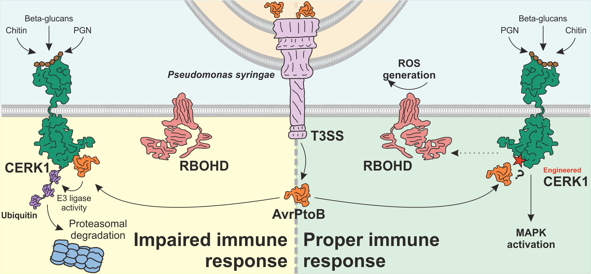
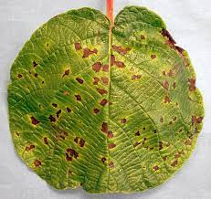
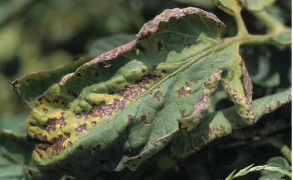
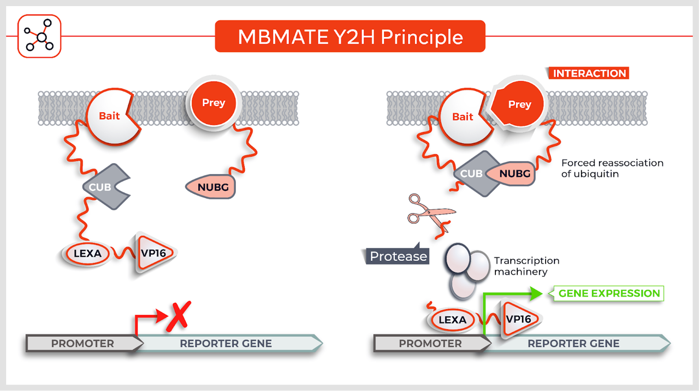

# Background

## Threats to global food supply
With a rising global population and greater weather variability due to climate change, food insecurity has become increasingly problematic. Recent estimates by the American Phytopathological Society (2023) indicate a global reduction of up to 40% in crop yields due to pests and diseases. Another study shows the impact on specific crops, revealing wheat losses of 10-28%, rice losses of 25-41%, maize losses of 20-41%, potato losses of 8-21%, and soybean losses of 11-32% attributed to pathogens and pests (Savary et al., 2017).

<figure markdown>

<figcaption>Figure 1. IPPC Secretariat. 2021. Scientific review of the impact of climate change on plant pests – A global challenge to prevent and mitigate plant pest risks in agriculture, forestry, and ecosystems.</figcaption>
</figure>

These diseases negatively impact crop yield and quality, posing a substantial challenge for the agricultural sector (Martins et al., 2018; Savary et al., 2017), leading to an economic burden on agricultural economies and higher food prices.
The spread of plant diseases also leads to increased use of chemical pesticides, which is detrimental to soil health, water quality, and biodiversity. This makes the challenges for sustainable agriculture even tougher (Gunstone et al., 2021). 

For these reasons, developing crops with enhanced resistance to pathogens is indispensable to ensure food and economic stability. Creating more resistant crops requires a multi-disciplinary approach, including advances in genetic engineering and deepening knowledge of plant-pathogen interactions. 

## Plant immunity
<figure markdown>

<figcaption>Figure 2. Schematic representation of molecular events in a plant cell harbouring an AvrPtoB-susceptible (left part) and an AvrPtoB-resistant CERK1 (right part).</figcaption>
</figure>

Plant innate immunity relies on pattern recognition receptors (PRRs), membrane proteins that detect potential pathogens. They do this by recognizing specific molecules from pathogens, the so-called pathogen-associated molecular patterns (PAMPs). Examples of PAMPs include flg22, a 22-amino-acid peptide from flagellin (the building block of flagella) of bacteria, and peptidoglycan and chitin from bacterial and fungal cell walls, respectively.
Upon detection of PAMPs, the PRRs trigger a defensive response within the plant to halt the pathogen's progression and spread (Boutrot & Zipfel, 2017; Zipfel, 2014). The immune response proceeds progressively, through multiple different pathways, depending on the sensed threat (Boller & Felix, 2009). The start of the response is characterised by changing ion fluxes, considerable production of reactive oxygen species (ROS), activation of the mitogen-activated protein kinase (MAPK) pathway, and the subsequent phosphorylation cascades. Out of these early responses, the ROS burst is of special importance as it can be easily detected and measured using luminol’s H2O2-dependent luminescence. Later stages of the immune response are mainly characterized by the production of the stress hormone ethylene, immune gene activation, and callose deposition.
Phytobacteria can evade this immune response by introducing virulence proteins, called effectors, into plant cells via different secretion systems. The secretion systems function like elaborate hypodermic needles, injecting pathogen effectors into the plant cell, and sabotaging the immune response from within. The mechanisms of effector action are very diverse (Macho & Zipfel, 2015): HopAO1 dephosphorylates its target PRR, inactivating it in the process;  AvrPto binds its target PRR and prevents it from carrying out its normal function; AvrPphB acts as a targeted protease chopping its PRR target into pieces; AvrPtoB acts as a ubiquitin ligase, hijacking the plant protein degradation system target and destroy its own PRR.

Among the different phytobacteria, Pseudomonas syringae ranks as the most devastating bacterial pathogen worldwide (Mansfield et al., 2012). This pathogen produces a well-characterised effector called AvrPtoB, which targets the PRR CERK1, leading to the inhibition of the plant immune response. This receptor is effective at detecting chitin and peptidoglycan, originating from fungi and bacteria, respectively, providing a broad range of defensive recognition from multiple kingdoms (Ao et al., 2014). The disruption of CERK1 function leads to a ten-fold increase in pathogen proliferation, highlighting its crucial function in plant immunity. 
We decided to tackle these problems using directed evolution to evolve plant receptors and make them  less prone to diseases. With this we also hope to establish directed evolution as a viable method to disrupt protein-protein interactions across all realms.

<figure markdown>

<figcaption>Figure 3. S. Loreti, Bacterial cancer of kiwifruit, 2018.</figcaption>
</figure>

<figure markdown>

<figcaption>Figure 4. Gerald Holmes, Tomato bacterial speck, 2000.</figcaption>
</figure>

<figure markdown>

<figcaption>Figure 5. Greg Martin, A tomato with bacterial speck, 2016.</figcaption>
</figure>

## Yeast two-hybrid
Yeast two-hybrid (Y2H) is the oldest and one of the most popular genetic methods used to identify protein-protein interactions in live yeast cells (Fields & Song, 1989). This method takes advantage of the fact that transcription factors are modular in nature. Namely, they contain distinct activation (AD) and DNA-binding domains (DBD), responsible for activating transcription and binding promoter DNA sequences, respectively. One can exploit this by fusing AD to protein A (also called prey in the field) and DBD to protein B (also called bait). In case proteins A and B interact with each other, they will bring the AD and DBD close to one another, allowing for them to activate the transcription of reporter genes (Fig. 6 right). To make sure this system expresses the correct gene, reporter genes used contain a DBD-binding motif (also called upstream activating sequence or UAS) within its promoter sequence. Reporter genes are genes whose transcription generates easily detectable results. For example, the expression of LacZ normally causes white yeast colonies to turn blue when grown on media containing X-gal, while the expression of Ura3 allows yeast to grow on media lacking uracil, an essential metabolite. What we described is the so-called forward direction in the Y2H system which is, again, designed to detect protein-protein interactions.

<figure markdown>

<figcaption>Figure 6. Schematic representation of the forward and reverse directions in the yeast two-hybrid assay</figcaption>
</figure>

## Reverse Y2H
In theory, there is nothing preventing the use of a negative readout from the reporter gene as an indication of no interaction between two proteins (Fig. 6 left). It was precisely this thinking that led to the development of the first reverse yeast two-hybrid (rY2H) method, aimed at selecting against protein-protein interactions (doi: 10.1093/nar/24.17.3341). The main change in the system was the use of a counterselectable reporter gene whose transcription and translation led to a toxic protein. As such, yeast that contained interacting proteins would die off, leaving only colonies harbouring non-interacting proteins. A final improvement merged the forward and reverse directions in a single system using the Ura3 reporter gene (doi: 10.1073/pnas.93.19.10315). On one hand, in a medium lacking uracil, Ura3 transcription is essential for growth. On the other hand, if one adds 5’-fluoroorotic acid (5FOA) to the medium, Ura3 transcription transforms it into a toxic metabolite, killing the cell. Therefore, one can plate the same yeast strain, on media lacking uracil to select for protein-protein interactions or on media with 5FOA to select against them. Nonetheless, existing rY2H systems still have numerous limitations, many of which we cover in the next section and in our results section.

## Problems of existing rY2H systems
Existing rY2H systems have been of great importance in investigating which regions are important in protein-protein interactions. Nonetheless, there are a number or potential pitfalls when applying these methods in the context of directed evolution.

**1. High rate of truncation mutations**
The problem of high rates of truncation mutations arises when we consider that our workflow includes an error-prone PCR (epPCR) step, which in essence, introduces random mutations into CERK1. The easiest way for a mutation to disrupt the interaction between CERK1 and AvrPtoB is for it to be a truncating mutation. Such mutations fall into one of two categories: i) substitutions that change a codon specifying an amino acid to a stop codon, and ii) insertions or deletions which cause the downstream sequence to fall out-of-frame. Regardless of its type, truncating mutations almost always severely affect the protein’s structure, and in turn its function. Thus, truncating mutations are highly likely to result in a positive readout on the rY2H assay, but they are also just as likely to result in a non-functional CERK1 protein. Unfortunately, these mutations are also very common in rY2H assays, with more than 97% of positive colonies expected to contain truncated alleles (Gray et al., 2007). As the end goal of our project was to disrupt the CERK1-AvrPtoB interaction while keeping the original function of CERK1 intact, it was paramount to devise a way to select against truncating mutations. However, standard reverse yeast-two hybrid (rY2H) methods described by Vidal et al. or Leanna et al. are not equipped with a truncation-elimination system.

**2. Mutual interference between the target protein and the anti-truncation fusion.**

As truncating mutations are not a novel problem, over the years, several independent groups have already come up with rY2H methods capable of selecting against truncation mutations. All of them are based on covalently fusing a truncation-indicating protein at the C-terminus of the target protein. Examples include fluorescent proteins (Endoh et al., 2000), reporter genes like URA3 (Lickfeld & Schmitz, 2011), antibiotic resistance genes (Gray et al., 2007; Anaka, 2019), etc. Although the reported cases don’t show evidence of any mutual interference, it remains a potential problem whenever the system is applied to novel protein pairs. We will show that fusing proteins C-terminally of CERK1 significantly affects its interaction with AvrPtoB. This is also backed up by previous research showing that C-terminally fused proteins can affect PRR function (Hurst et al., 2018). 

**3. The target gene is sometimes restricted to the AD vector to avoid truncation**

To avoid both the truncation mutations and the mutual interference, Vincent et al. have proposed the reverse double yeast two-hybrid (RD2H), whose anti-truncation system relies on the PTAP peptide C-terminally fused to the prey protein and another yeast two-hybrid system that can detect the existence of the PTAP peptide. Unfortunately, this method restricts the target protein (CERK1 in our case) to be fused to the AD which, we will show (LINK), would interfere with the CERK1-AvrPtoB interaction. This restriction is also present in the One-plus Two-hybrid system developed by Kim et al..

Therefore, we opted to develop a novel reverse yeast two-hybrid system, the Truncation Resistant and Universal Self-cleaving peptide Technology reverse yeast two-hybrid (TRUST-rY2H), which 1) selects against truncating mutations, 2) with only minimal mutual interference between the target protein and truncation indicating tag, and 3)  allows for target protein fusion to either AD or DBD (Figure whichever).

## Variants of yeast two-hybrid: membrane protein yeast two-hybrid system
Apart from the conventional yeast two-hybrid that harnesses the modularity of AD and DBD and the interaction happens in the nucleus, diverse genetic methods have been developed to test protein-protein interactions (Stynen et al., 2012). For example, the second most commonly used genetic method to study PPI is the split ubiquitin-based membrane protein yeast two-hybrid (MYTH) system, which is specially designed to study the interaction between membrane proteins (Iyer et al., 2005).

The MYTH system is based on fusing the halves of ubiquitin to two interacting proteins, at least one of which is membrane-bound. Upon interaction of these two proteins, the halves of ubiquitin are brought together, cleaving the linker connecting the transcription factor to the system. Following cleavage, the transcription is free to enter the nucleus and activate the transcription of reporter genes (Iyer et al., 2005).

<figure markdown>

<figcaption>Figure 6. Schematic representation of MYTH in the case the proteins of interest interact (left) and don't interact (right). Taken from Hybrigenics Services SAS.</figcaption>
</figure>

To our knowledge, except the conventional Y2H, there is no reverse system successfully developed for other genetic PPI assays, only a failed attempt (Sahin, 2019). In terms of truncation elimination, some strategies are limited to the conventional Y2H (Kim et al., 2007; Vincent et al., 2020), some can potentially be used for other genetic PPI assays like MYTH but with the risk of impairing the interaction detection.

PRRs are membrane-localized proteins.To better target PRRs, some effectors also have membrane localization, for example, AvrPto (Shan et al., 2000), which targets several PRRs and BAK1, the shared co-receptor and many PRRs. The interaction between AvrPto and BAK1 can be only detected by MYTH, but not the conventional Y2H in yeast (Shan et al., 2008), suggesting that MYTH is an indispensable method to study, as well as disrupt PRR-effector interactions 

