## Achievements
Key achievements:

* Pioneered using directed evolution technology to create disease resistant crops

* Proposed a novel strategy to enhance plant immunity by engineering plant pattern recognition receptors to elude attacks by effectors

* [Developed TRUST-rY2H, a novel reverse yeast two-hybrid system (rY2H) to disrupt protein-protein interactions.](##Development of TRUST-rY2H, a novel reverse yeast two-hybrid system)

* [Identified mutations disrupting CERK1-AvrPtoB interaction using TRUST-rY2H and machine learning-based computational design.] (##_In silico_ prediction of interaction-disrupting mutations)

* [Designed a screening method to rapidly test the activity and AvrPtoB resistance of CERK1 variants in plants.] (## _In planta_ screening of AvrPtoB-resistant CERK1 variants that retain kinase activity via transient expression in N. benthamiana)

We also:

* [Developed a reverse assay for split-ubiquitin membrane protein yeast two-hybrid (MYTH) to disrupt the interaction between membrane proteins.] (##Development of TRUST-rMYTH, a reverse split ubiquitin-based membrane protein yeast two-hybrid system with E2A-BleoR anti-truncation strategy)

* [Developed fluorescent reporters for conventional Y2H and MYTH to precisely measure the strength of protein-protein interactions.] (##Construction of fluorescent reporter strains to quantitatively measure interaction strength )

# Results
## AvrPtoB interacts with CERK1 and impairs CERK1-mediated immune responses

Effectors often target PRRs, the CERK1-AvrPtoB interaction seems to be an exception. To be able to disrupt the interaction, we first need to verify that AvrPtoB indeed targets CERK1 and analyse the effect of AvrPtoB on the CERK1 mediate immune response.

**Aim:** Prove AvrPtoB targets CERK1 and leads to impaired immune response.
A Y2H plate assay was performed using AvrPtoB and CERK1 fused to both DBD and AD interchangeably (**Fig. 1**). In this assay, cells grow in a selective medium (-LWU) if an interaction between the proteins is present. The experiment group of DBD-CERK1 and AD-AvrPtoB showed high levels of growth, superseding even the established positive control protein pair (Antigen T and p53). This confirms a strong interaction between our two proteins of interest. 

<figure markdown>
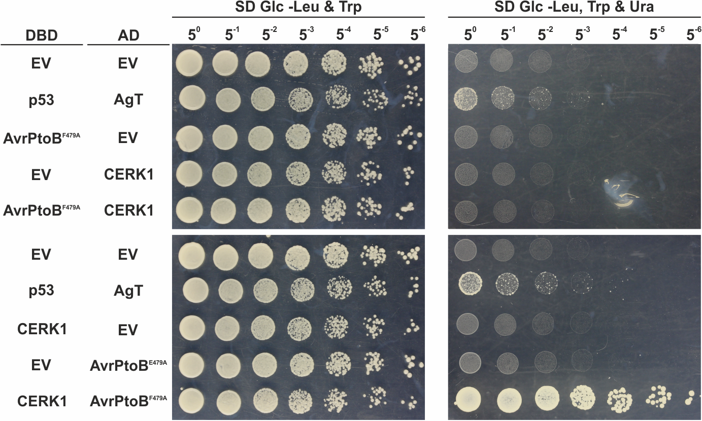
<figcaption> Figure 1. CERK1 and AvrPtoB strongly interact in the Y2H assay only when fused to AD and DBD, respectively.</figcaption>
</figure>

To follow this up, we wanted to ensure that AvrPtoB did indeed impair the immune response of plants. We treated plants with chitin to simulate a fungal infection, triggering the CERK1-mediated immune response. The intensity of the immune response can be quantified by measuring the reactive oxygen species (ROS) burst following the chitin treatment (**Fig. 2**). When we transiently transformed the plants with an estradiol-inducible AvrPtoB DNA construct (XVE/OlexA-AvrPtoB) and the treated the plants with estradiol, the ROS burst was significantly reduced, indicating that AvrPtoB indeed impairs CERK1’s functions.

<figure markdown>
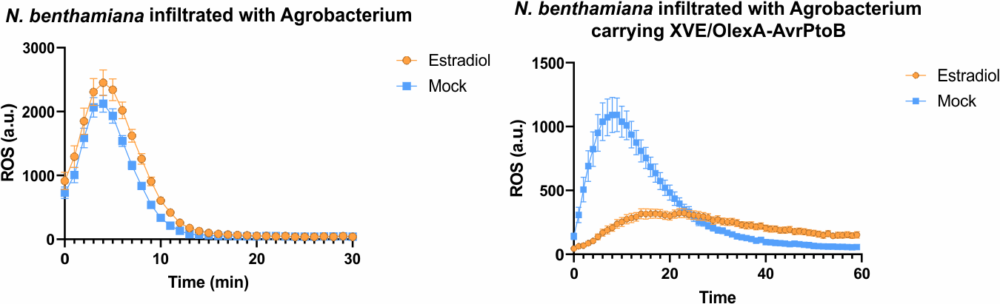
<figcaption>Figure 2.  Transient expression of AvrPtoB attenuates the chitin-triggered ROS burst in N. benthamiana. </figcaption>
</figure>

**Conclusion:** AvrPtoB binds CERK1 and impairs CERK1-mediated immune responses. However, the fusion of DBD and AD in the Y2H seems to affect the interaction. This can be seen as in one sense, the interaction is strong, and in the other sense there is little growth compared to negative controls. This indicates a false negative, and a need for a more robust system.

## Development of TRUST-rY2H, a novel reverse yeast two-hybrid system

Original rY2H methods are unable to distinguish between informative interaction-disruption mutations, and false positives resulting from truncating mutations. Unfortunately, the systems that do resist truncations, such as the RD2H, are rigid in their design, not allowing the exchange of DBD and AD between the proteins of interest. This lack of flexibility can be detrimental when analysing certain protein-protein interactions (PPI), as the DBD or AD can hinder the interaction, leading to false-negative results as already seen in our [initial experiments](##AvrPtoB interacts with CERK1 and impairs CERK1-mediated immune responses).

**Aim:** Develop a novel rY2H system, capable of selecting against truncating mutations and flexible with AD and DBD fusions, to disrupt the CERK1-AvrPtoB interaction.

As mentioned, the interaction between DBD-CERK1 and AD-AvrPtoB cannot be seen when DBD and AD are switched between the proteins. Current systems for truncation-resistant Y2H mandate that the protein undergoing mutagenesis is fused to AD. This meant we would not be able to test CERK1 for truncation within current systems. To solve this problem, we devised a system that would fuse BleoR, a gene conferring resistance to the antibiotic zeocin, to CERK1 variants. This would mean that BleoR would only be expressed if the CERK1 variant was complete, i.e. not truncated, and therefore the cells would be able to grow in zeocin-containing media (**Fig. 3**).

<figure markdown>
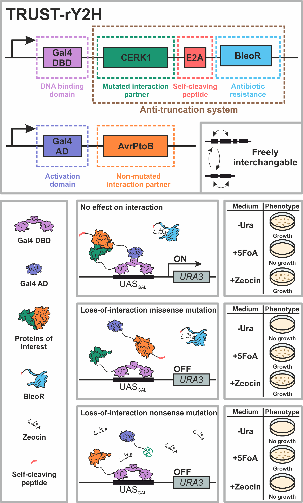
<figcaption> Figure 3. Schematic explanation of the TRUST-rY2H system (upper panel) and its behaviour depending on the interaction state and selective media used (lower panels).</figcaption>
</figure>
We originally fused the BleoR to CERK1 by using a (GS)3 linker, a long stretch of glycine and serine residues, but this approach disrupted both the CERK1-AvrPtoB interaction, as well as BleoR anti-zeocin activity. This mutual interference was almost certainly due to the proximity of BleoR and the CERK1-AvrPtoB interaction complex. We hypothesised that this issue could be solved by using a self-cleaving peptide, E2A, which would separate CERK1 and BleoR once they had been translated (see **Fig. 3** for a schematic representation). A rY2H assay (**Fig. 4**) shows that the version with the (GS)3 linker, compared to the one using E2A, clearly exhibited worse growth on -Ura and +Zeocin plates, indicating the lack of CERK1-AvrPtoB interaction and BleoR activity, respectively. This confirmed that using E2A considerably reduced the interference BleoR and the CERK1-AvrPtoB complex had on each other. 

<figure markdown>
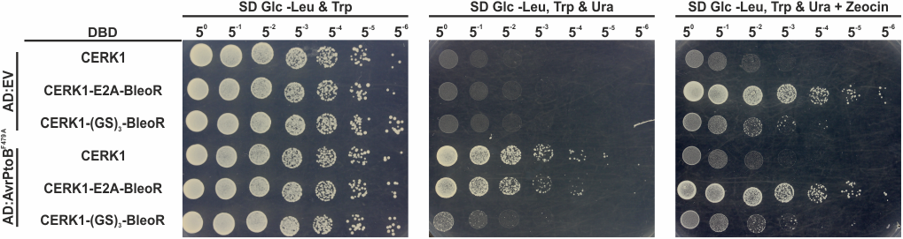
<figcaption> Figure 4. Using an E2A self-cleaving peptide instead of the (GS)3 linker reduces the negative impact the BleoR anti-truncation system has on the CERK1-AvrPtoB interaction.</figcaption>
</figure>

We also tested whether other self-cleaving peptides, O2A and P2A, could do a better job. However, we found E2A to be the most effective (**Fig. 5**).

<figure markdown>
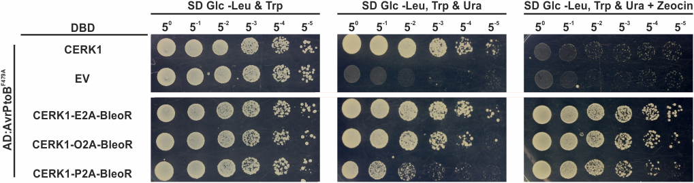
<figcaption>Figure 5. Compared to other self-cleaving peptides, the E2A peptide causes minimal disruption of the CERK1-AvrPtoB interaction.
 </figcaption>
</figure>

We also used a [fluorescent reporter strain](##Construction of fluorescent reporter strains to quantitatively measure interaction strength ) to precisely quantify the effects of different 2A peptides on CERK1-AvrPtoB interaction (**Fig. 6**). We got similar results as the plate assay, indicating that E2A is the best option.

<figure markdown>
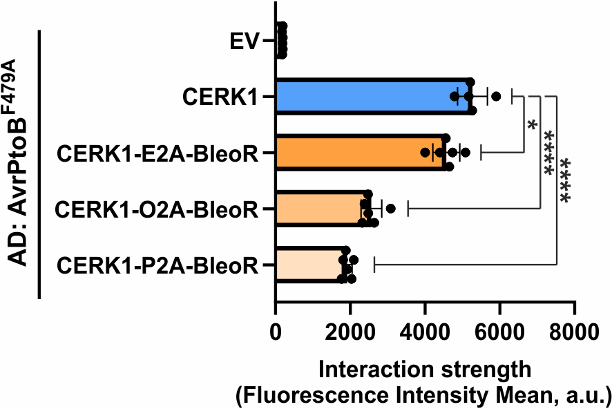
<figcaption>Figure 6. Differences between sample means in the flow-cytometry data were assessed using one-way ANOVA with Dunnett’s posthoc test; <0.01 (*), <0.0001(****). </figcaption>
</figure>

Lastly, we wanted to test whether the E2A-BleoR anti-truncation strategy was capable of selecting against truncations in practice. To do this, we manually introduced a stop codon, as well as a 1-bp deletion to the DNA sequence CERK1. 

Initially, we did a Y2H plate assay starting from colonies which have been grown for >48h post transformation (**Fig. 7**). Unfortunately, the result shows that our system wasn’t capable of successfully selecting against truncation mutations, as evidenced by yeast growth on zeocin-containing plates.

<figure markdown>
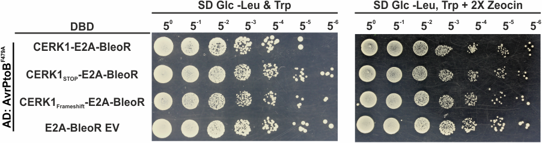
<figcaption> Figure 7. The addition of E2A-BleoR is not sufficient to select against truncating mutations when colonies were selected for more than  48h post transformation.</figcaption>
</figure>

We then redid the assay by plating the yeast that have just been transformed with the plasmids harbouring the Y2H system, as would be done in our directed evolution workflow (**Fig. 8**). This time, the truncated mutant showed notably less growth, implying that our system works. This is perhaps due to the leaky expression of BleoR, which might be caused by sequences in CERK1 which resemble canonical translation start sites (Monteuuis et al., 2019). Over time, the leaky expression could lead to the accumulation of BleoR, allowing even the truncated mutants to grow on zeocin-containing plates. To overcome this, we plan to introduce D25A mutation to BleoR to compromise its activity by ~ 50% (Dumas et al., 1994), which has been proven useful in counteracting leaky expression (Tominaga et al., 2021). 
<figure markdown>
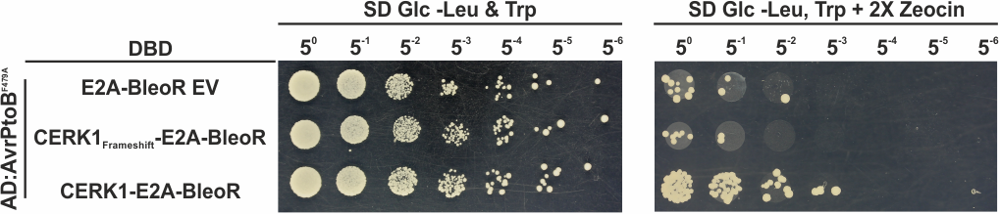
<figcaption>Figure 8. When plated immediately post-transformation, truncation mutations are selected against by the BleoR anti-truncation system. </figcaption>
</figure>

We coined this system TRUST-rY2H, a reverse yeast two-hybrid (rY2H) system that is Truncation-Resistant and Universal, using Self-cleavage peptide Technology (TRUST). We summarised the comparison of TRUST-rY2H to some of existing rY2H methods in Table 1.

Table 1. Comparison of TRUST-rY2H to previous methods 
| | System avoids truncations|Single step selection | Protein of interest can be fused to both the activating domain and DNA binding  domain | Compatible with membrane systems (split ubiquitin system) |
| --- | --- | --- | --- | --- |
| **Original rY2H**| - | - | - | + |
| **rY2H**(Vidal et al.) | + | - | + | - |
| **rY2H** (Leanna et al.) | - | - | + | - |
| **rDY2H** (Vincent et al.) |+ | + | - | - |
| **One-plus Two Hybrid system**(Kim et al.) | + | - | - | - |
| **TRUST-rY2H**(Kim et al.) | + | + | + | + |

**Conclusion:** Fusing BleoR to proteins along with a self-cleaving peptide has minimal effect on the protein interaction and could, with further optimisation, provide adequate truncation resistance.

## Disruption of CERK1-AvrPtoB interaction using TRUST-rY2H

The TRUST-rY2H is ready. Now it’s time to use it to achieve our goal, disrupting CERK1-AvrPtoB interaction.

**Aim:** Use TRUST-rY2H to disrupt CERK1-AvrPtoB interaction.

We performed mutagenesis on CERK1 using error-prone PCR, and subjected the mutagenesis library to TRUST-rY2H to select for mutations that disrupt CERK1-AvrPtoB interaction. For comparison, we also run a classic rY2H in parallel, which is without an anti-truncation system. Ten colonies from each screen were sequenced to identify mutations (Table 2). Three out of ten colonies from TRUST-rY2H were false positives with nonsense mutations (stop codons), while the classic rY2H screen produced two such false positives. Interestingly, only two mutations (S444F and G461R) were located in or close to the predicted interaction interface. Other mutations were dispersed throughout the whole protein sequence, suggesting a diverse array of mutations impacting the interaction beyond the predicted interaction surface.

TABLE

It seems that TRUST-rY2H underperforms the classic rY2H, however, it is noteworthy that the truncation rate in the classic rY2H (20%) is far lower than reported (>97%) (Barr et al., 2004, Gray et al., 2007). One possibility is that some of the hits are false positives. This can be because of mutations disrupting DBD, promoter, and Ura3 gene, which can also lead to a 5-FOA-resistant phenotype. Therefore, we need to confirm these mutations by performing a round of forward Y2H. Another possibility is that CERK1-AvrPtoB is sensitive to mutations, i.e., among all the potential interaction-disruption mutations, there are many more non-truncation mutations than truncation mutations. Such results could also be due to stochastic colony picking and requires more colonies to achieve statistical robustness.

**Conclusion:** We successfully identified mutations on CERK1 that disrupt its interaction with AvrPtoB using both TRUST-rY2H and classic rY2H. We need to sequence and validate more colonies to statistically compare the performance of TRUST-rY2H and classic rY2H.

## _In silico_ prediction of interaction-disrupting mutations
New machine-learning based technologies are at the forefront of PPI predictions and simulations. We decided to use this to our advantage by predicting the CERK1-AvrPtoB interaction to identify key amino acids that could be mutated in a site-directed manner to disrupt the interaction.

**Aim: **Predict the interaction between CERK1 and AvrPtoB to identify potential mutations to disrupt interaction

Using AlphaFold-Multimer, an artificial intelligence tool specialised for predicting protein-protein complexes, to predict the CERK1-AvrPtoB interaction at an atomic level (**Fig. 9** left). Having a 3D model of the CERK1-AvrPtoB interaction complex, we could start investigating the binding interface - the area on the two proteins that interact with each other. Unfortunately, the prediction obtained using AlphaFold-multimer didn’t have a satisfactory model confidence, i.e., certain areas could have been predicted wrong. As all of our downstream work depends on the accuracy of the interaction complex prediction, we opted to try other prediction tools, namely ColabFold. Additionally, one of the possible culprits behind this low model confidence were long, intrinsically disordered regions in both CERK1 and AvrPtoB (**Fig. 9** right). These parts of the protein didn’t participate in the interaction itself, and didn’t have any clear 3D structure of their own, making it difficult for the model to accurately describe them. To make sure they didn’t interfere with the protein complex prediction, we removed for the second round of predictions. These two choices paid of in the end, as the second prediction ended up with satisfactory model confidence, allowing us to proceed with the analysis.

<figure markdown>
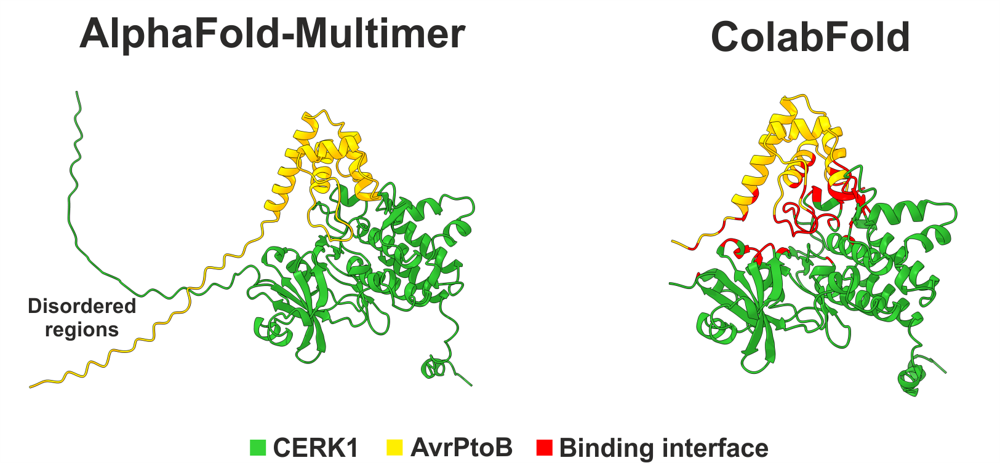
<figcaption>Figure 9. Prediction of AvrptoB-CERK1 binding complex from AlphaFold-Multimer and Colabfold. </figcaption>
</figure>

Looking at the 3D structure, we first found residues in the two proteins that interacted with each other, i.e., were at an acceptable distance from each other or had physio-chemical properties facilitating interactions, such as opposing polarities. Then, within the binding interface, we found residues in CERK1 that interacted with particularly many residues in AvrPtoB. If we could mutate these residues, they might severely affect the stability of the interaction complex, without causing a big change to CERK1 itself. We made sure to avoid functionally important regions of CERK1, as to keep its immune function intact. Lastly, to make sure given mutations do not completely destabilise the global CERK1 structure, we used an additional AI tool called Protein MPNN. This multipronged approach resulted in the following seven mutations: L462S, R474E, F480K, M483R, V488K, V515M, and F525T.

To validate our predictions, we ran a Y2H assay in both forward and reverse direction (**Fig. 10**). Variants that grew on plates lacking uracil, but failed to grow those containing 5-FOA, failed to disrupt the CERK1-AvrPtoB interaction, and vice versa. Out of the seven computationally predicted mutants, five (L462S, M483R, F480K, V488K, V515M) successfully disrupted this interaction. This result highlights the importance of computational models in predicting promising site-directed mutagenesis targets.

<figure markdown>
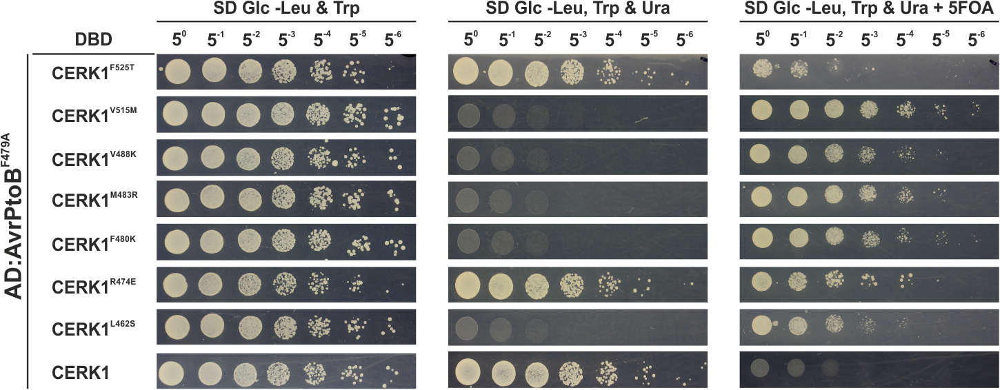
<figcaption> Figure 10. Experimental validation of in silico predicted mutations that disrupt CERK1-AvrPtoB interaction.</figcaption>
</figure>

**Conclusion:** The interaction between AvrPtoB and CERK1 was successfully predicted in silico， generating seven mutations potentially able to disrupt the interaction without affecting CERK1’s function. Y2H assay confirms that five of them can disrupt the interaction. 

## _In planta_ screening of AvrPtoB-resistant CERK1 variants that retain kinase activity via transient expression in N. benthamiana

Loss of interaction with AvrPtoB can be accompanied by loss of kinase activity. This concern is based on the site-directed mutagenesis analysis of AvrPtoB-BAK1 interaction, where many BAK1 mutants that lost interaction with AvrPtoB also lost their kinase activities (Cheng et al., 2011).

For CERK1, we found that two frequently used kinase-dead mutants, D441V and K350N, either lost or exhibited reduced interaction with AvrPtoB, respectively (**Fig. 11**). This result suggested that CERK1’s kinase activity and its interaction with AvrPtoB might be also closely correlated. Consequently, there was a need for a screening method, able to efficiently detect unimpaired CERK1 kinase activity.

<figure markdown>
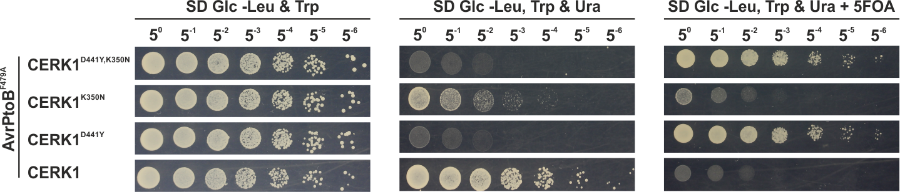
<figcaption> Figure 11. Kinase-dead CERK1 mutants lost interaction with AvrPtoB suggesting CERK1’s kinase activity and capability to interact with AvrPtoB are closely correlated.
</figcaption>
</figure>

**Aim:** Develop an efficient screening approach to check the functionality of CERK1 variants in plants.

To screen for CERK1 variants that retained their kinase activities, we used the fact that overexpression of functional CERK1 in Nicotiana benthamiana leads to cell death (Pietraszewska-Bogiel et al., 2013; Suzuki et al., 2018). To this end, CERK1 variants are transiently expressed in wild-type N. benthamiana under a strong and constitutive 35S promoter. Those variants whose transient expression leads to a cell death phenotype should retain the kinase activity (**Fig. 12**).

<figure markdown>
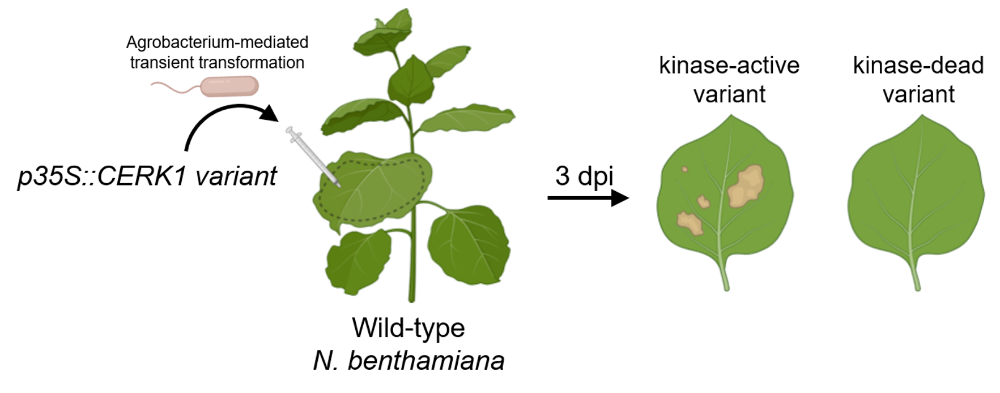
<figcaption> Figure 12. The assay used to screen for CERK1 variants that retain kinase activity, which is based on overexpression of CERK1 variants and observation of cell death phenotype. “3 dpi” means “three days after infiltration”.
</figcaption>
</figure>

We initially tested our system using the wildtype CERK1 and CERK1D441V one of the kinase-dead variants which also lost its interaction with AvrPtoB. As expected, the wildtype CERK1 showed the cell death phenotype, while a kinase-dead mutant (D441V) did not (Figure 13). Unfortunately, due to time constraints, we weren’t able to test any of the variants obtained using either the directed evolution or site-directed mutagenesis.

<figure markdown>
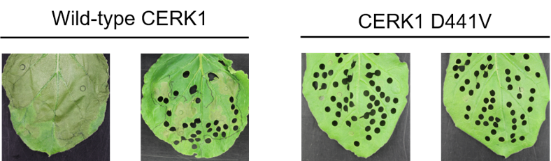
<figcaption> Figure 134  Expression of wild-type CERK1 and not the D441V kinase-dead mutant caused cell death in N. benthamiana. (Please ignore the holes on the leaves. They are just because we took some leaf discs.)
</figcaption>
</figure>

Active CERK1 variants will be subjected to a second round of in planta screening designed to screen for real AvrPtoB-resistant CERK1 variants (**Fig. 14**). This round of screening will be conducted using a N. benthamiana line which doesn’t produce its native CERK1 (NbCERK1). This was achieved through virus-induced gene silencing (VIGS). These silenced plants produce no CERK1, so we are able to express and test our CERK1 variants in them. Our CERK1 variants will be expressed using the native promoter (ProCERK1), ensuring a low enough expression level to avoid cell death, but high enough to result in a measurable ROS burst in response to chitin treatment. At the same time, AvrPtoB will be also expressed using an estradiol-inducable promoter. By comparing the chitin-triggered ROS bursts of mock and estradiol treatment groups, we can determine whether the CERK1 variant is resistant to AvrPtoB (**Fig.14**).

<figure markdown>
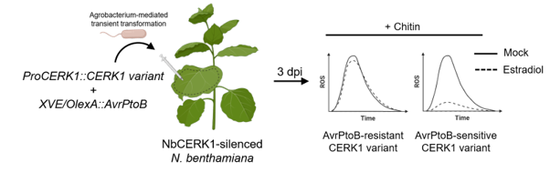
<figcaption> Figure 14. The assay used to screen for AvrPtoB-resistant CERK1 variants in planta.
</figcaption>
</figure>

Once again, time constraints did not allow us to test variants, but we were able to show that we had successfully silenced the native CERK1 genes. We did this by performing a ROS burst assay, where the silenced plants showed no response to chitin when compared to non-VIGS plants (**Fig. 15**).

<figure markdown>
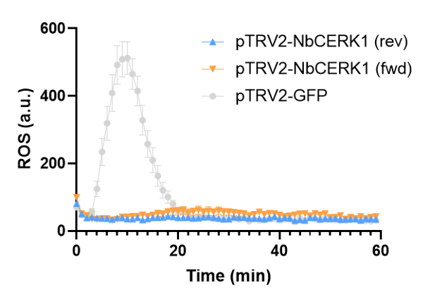
<figcaption> Figure 15. Successful silencing of native CERK1 of N. benthamiana using VIGS.
</figcaption>
</figure>

**Conclusion:** We successfully designed a two-round screening approach to rapidly screen for functional and AvrPtoB-resistant CERK1 variants in plants.

## Development of TRUST-rMYTH, a reverse split ubiquitin-based membrane protein yeast two-hybrid system with E2A-BleoR anti-truncation strategy

As already mentioned in the Background section, aside from the conventional Y2H systems, many genetic methods have been developed to study protein-protein interactions. One popular approach is the split-ubiquitin membrane protein yeast two-hybrid (MYTH). Unfortunately, the system is currently usable only in the forward direction, with no successfully developed reverse variations. Therefore, we strived to develop a reverse MYTH system using the E2A-BleoR strategy to eliminate truncation mutations.

Aim: Develop an assay to disrupt the interaction between membrane proteins and prove that the E2A-BleoR anti-truncation strategy can be extensively applied to different genetic PPI assays.

To allow our novel MYTH system to run in both directions we chose to base it on the _Ura3_ reporter gene (Link to reverse Y2H part in introduction). To that end, we repurposed the FRY1537 yeast strain (Ottoz et al., 2014), which already carries a _Ura3_ gene driven by a synthetic promoter that can be activated by the LexA-VP16 synthetic transcription factor. With this, we had all the components for the rMYTH system, they just required a bit of putting together. To obtain results that are a bit more quantitative than the yeast plate assays, we also constructed a fluorescence-based yeast strain. In the case of protein-protein interaction, this yeast will emit fluorescence, which can be easily measured using a flow cytometer or a plate reader.

As a proof-of-concept, we used two well-studied single-pass membrane proteins in the plant immune systems, BAK1 and BIR2, to test our rMYTH system (**Fig. 16A**). BAK1 and BIR2 have been reported to interact with each other through both extracellular and intracellular domains (Ma et al., 2017; Halter et al., 2014). As the residues on the interaction surfaces were previously identified, we generated mutations on some of these residues to disrupt either extracellular or intracellular interaction or both of them (**Fig. 16B**). 

<figure markdown>
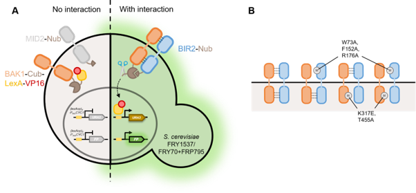
<figcaption> Figure 16. (A) Schematic diagram of the rMYTH design used for selection of loss-of-interaction mutations on the plate with 0.5 mg/mL 5-FOA. (B) BAK1 and BIR2 with interaction-disrupting mutations are used to test the rMYTH system.
</figcaption>
</figure>

Different mutations resulted in BAK1-BIR2 pairs with different levels of interaction strength, which were quantified by the fluorescence readout (**Fig. 17** rightmost bar plot). As shown in the plate assay results (**Fig. 17**), there was a positive correlation between the interaction strength and the cell growth on the plate without uracil, while the 5-FOA plate showed an opposite trend. These results suggest the success of repurposing FRY1537 as a reporter strain for rMYTH.

<figure markdown>
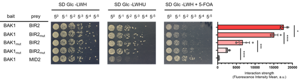
<figcaption> Figure 17. E2A-BleoR can be fused after either Nub or Cub-LexA-VP16 without or only mildly affecting BAK1-BIR2 interaction
Differences between sample means in the flow-cytometry data were assessed using one-way ANOVA with Dunnett’s post-hoc test; <0.01 (*), <0.0001(****)
</figcaption>
</figure>

We then tested whether the E2A-BleoR anti-truncation strategy can be also applied to rMYTH (**Fig. 18**) E2A-BleoR and (GS)3-BleoR were fused after Cub-LexA-VP16 for the bait construct and after Nub for the prey construct, respectively. The fusions of E2A-BleoR after Nub and Cub-LexA-VP16 had no effect and a neglectable negative effect on BAK1-BIR2 interaction, respectively. For (GS)3-BleoR, a 50% decrease of interaction strength was observed when it was fused after the Nub, suggesting that the covalent fusion severely interfered with the detection of interaction. When  (GS)3-BleoR was fused after the Cub-LexA-VP16, an increase in the interaction strength was observed, which implies that (GS)3-BleoR can cause false positive results, perhaps because of the homodimerization of BleoR (Dumas et al., 1994).

<figure markdown>
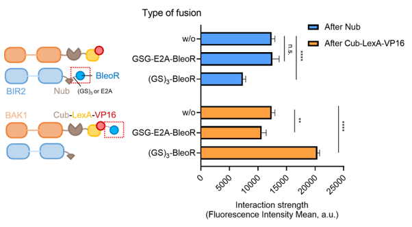
<figcaption> Figure 18. Fusion of E2A-BleoR after Nub or Cub-LexA-VP16 has little consequence on interaction
</figcaption>
</figure>

**Conclusion:** We successfully developed TRUST-rMYTH, a reverse split-ubiquitin membrane protein yeast two-hybrid system equipped with E2A-BleoR anti-truncation strategy, which can be used to disrupt interactions between membrane-bound proteins while avoiding truncations.

## Construction of fluorescent reporter strains to quantitatively measure interaction strength 
In classic Y2H and MYTH assays, the existence of interaction and the difference of interaction strengths are concluded mainly based on the cell growth, which is not quantitative enough, and might not be able to detect the small changes of the interaction strength. Although most commercial strains are equipped with a LacZ reporter gene enabling the usage of enzymatic activity assays (like ONPG assay) to quantify the interaction, it is very labour-intensive to conduct such assays, especially when handling a large number of samples. 

**Aim:** To develop reporter strains carrying a fluorescent reporter gene for both conventional Y2H and MYTH to precisely measure the interaction strength. 

The construction strategies for the fluorescent reporter strains for both the conventional Y2H, as well as  MYTHare shown on **Figure 19**.

<figure markdown>
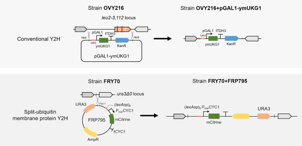
<figcaption> Figure 19. Construction of fluorescent reporter strain OVY216+pGAL1-ymUKG1 for the conventional Y2H, and FRY70+FRP795 for split-ubiquitin membrane protein Y2H.

</figcaption>
</figure>

As shown in Figure 20, the workflow, which is based on liquid handling, is very simple.

<figure markdown>
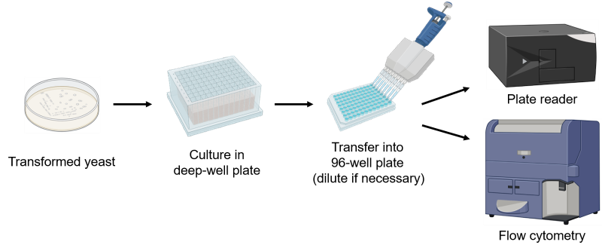
<figcaption>Figure 20. Workflow to quantitatively measure PPI strength using the fluorescent reporter strains.

</figcaption>
</figure>

These reporter strains have been already successfully used in our research to draw the following conclusions:

* In the TRUST-rY2H system, the E2A-BleoR fusion has almost no interference on the CERK1-AvrPtoB interaction, and E2A is the best 2A self-cleavage peptide in comparison with O2A and P2A (**Fig 6**).

* In yeast, BAK1 and BIR2 interact with each other through both the extracellular and intracellular domains (**Fig. 17**). 

* In the TRUST-rMYTH system, the E2A-BleoR anti-truncation module does not interfere with the interaction detection module (**Fig. 18**).

In the future, we will run a rY2H assay in strains carrying both _Ura3_ and fluorescent reporter genes, so that we can directly pick colonies from 5-FOA plates to measure to what extent the interaction is disrupted.
